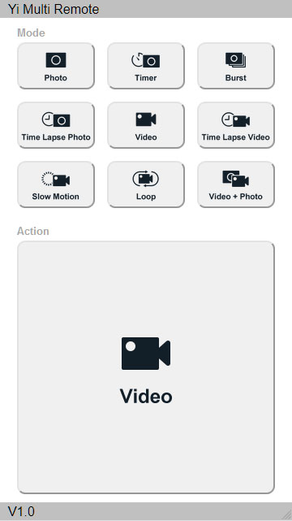

# Multi Yi cameras remote

**Trigger a couple of YI 4K+ Action Camera (aka "poor man's VR rig") with an ESP8266.**

Video sync is frame accurate (4k@60fps mode) but photo sync is random, from quite good to useless.\
I suspect the auto shutter mode to be the culprit of missync but didn't tried with manual settings
as I'm not too much interested in still pictures (at least using these cameras).

\
*People running after a ball make good sync test.*

## Prerequisites

To make your Yi 4K+ action cameras run in station mode, create a folder named `Wi-Fi.DEBUG` in
the root of each SD card.\
Then inside that folder create a file named `start.sh` and edit that file with your favorite text
editor (make sure to set the line endings to UNIX).

For the left camera SD card, your file should look like this:
````
#!/bin/sh
# Change the MAC adress according to your left camera
/usr/local/share/network/start.sh WIFI_MODE=sta STA_SSID=YiMultiRemote STA_PASSWD=YMR12345 STA_FREQ=0 STA_NAME=yi_cam_left STA_SCAN=1 STA_IP=192.168.0.10 CHIP_TYPE=43340 WIFI_MAC=58:70:C6:XX:XX:XX
````

For the right camera SD card, your file should look like this:
````
#!/bin/sh
# Change the MAC adress according to your right camera
/usr/local/share/network/start.sh WIFI_MODE=sta STA_SSID=YiMultiRemote STA_PASSWD=YMR12345 STA_FREQ=0 STA_NAME=yi_cam_right STA_SCAN=1 STA_IP=192.168.0.11 CHIP_TYPE=43340 WIFI_MAC=58:70:C6:YY:YY:YY
````

## Hardware
- ESP8266 - Wemos D1 module
- Momentary switch
- LED
- 68 ohms resistor (actual value depends on the LED model)
- Buzzer

### Wiring


### Enclosure
I found this [Hama foldable flash bracket](https://www.hama.com/00006831) quite handy
when coupled with a lipstick-sized battery pack.\


## Software
Multi Yi cameras remote was tested with version 2.4.2 of the Arduino libraries for ESP8266.

### External libraries
- https://github.com/bblanchon/ArduinoJson
- https://github.com/mathertel/OneButton
- https://github.com/me-no-dev/ESPAsyncWebServer

*See README of each library for specific installation instructions.*

## Miscellaneous

### Caveat
The following start-up sequence must be observed: power on the ESP8266, then the left camera,
finally the right camera.\
Reconnection is not supported in this version: if a camera disconnects, all devices must
be switched off and above sequence restarted from the beginning.

### Commands
- Button click: either captures photo or toggle video recording
- Button double click: alternates between photo and video mode
- Button long press: restarts ESP8266

As an alternative to the button, you can connect your smartphone to the AP and use the web interface.



### Useful links
- https://dashcamtalk.com/forum/forums/yi-4k-action-camera.224
- https://github.com/irungentoo/Xiaomi_Yi_4k_Camera
- https://github.com/jnordberg/yichan (also [this thread](https://github.com/jnordberg/yichan/issues/1))
- https://github.com/kongzii/xiaomi-yi
- https://github.com/NikolayRag/Yi4kAPI 

### Disclaimer
Even if I try to improve myself, my C++ skills are very limited: I do programming like a Lego player,
essentially by assembling bricks made by real programmers.\
You've been warned...

For a real disclaimer, see the .
